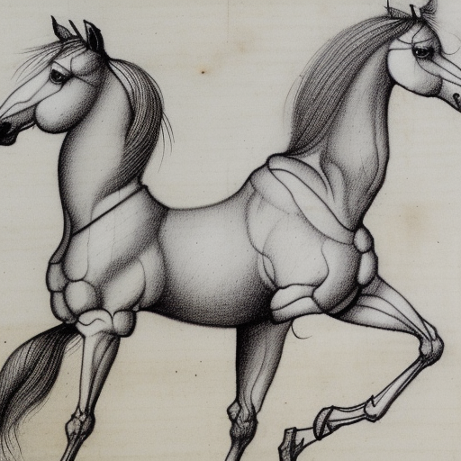
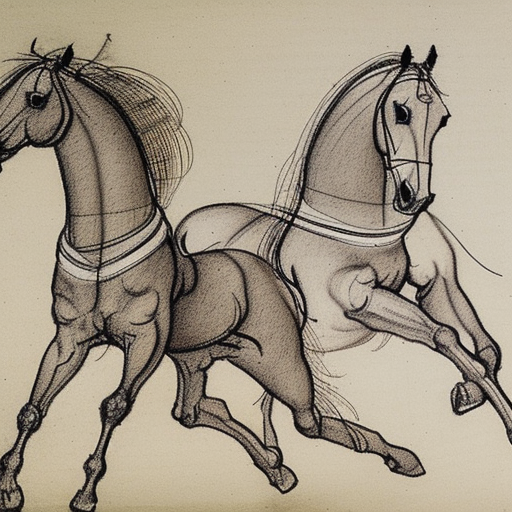
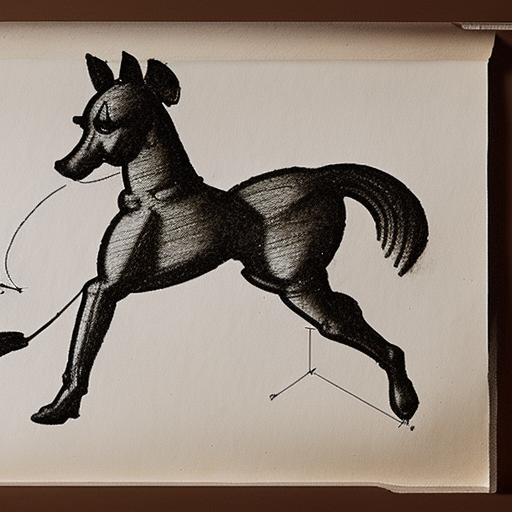

# {{title}}

Some time ago, out in the country, there lived two
horses: a white horse, and a brown horse.

The two horses were best friends.
They had grown up together,
they lived in the same barn,
had adjoining stalls,
and they liked each other
very much. They were very happy horses.

Every morning,
at a little past breakfast,
the two horses would race
around the track.
The brown horse and the white horse
were about the same age
and the same size.
Even so, the white horse always won.

One night, the brown horse had a dream that disturbed him very much. He
dreamed that Equus, the god of horses, appeared to him and said:
"Brown horse! Brown horse! You will race three more times, and then
you shall die!"

In the morning, the white horse could see that
his friend the brown horse was very upset.

"What's up, buddy?" the white horse asked.

"Oh, man, you won't believe this, but I had a dream last night that
Equus, the god of horses, came to me.
And he said 'You will race three more times, and then:
You. Shall. Die!'" the brown horse said.

"Wow," said the white horse, "that's a creepy dream."

As they trotted out to the pasture, the brown horse said, "Listen, I
know it's just a dream, but just in case, I'd like to win one race
before I die. So if you could... you know... take it easy today?"

"Sure thing, pal," the white horse said.

So they set off for their daily race.

As usual, they were pretty evenly matched.
At a quarter mile from
the finish, the white horse started pulling ahead.
"Dreams are dreams," he thought, "but racing is racing."

Confident that he would win,
the brown horse pushed harder, but not that much.
"Racing is racing," he thought, "but friendship is... is..."

As he pondered how to complete
the zeugma -- was it a zeugma? --
the white horse surged ahead and won.

After he caught his breath, the brown horse said,
"Hey. I thought you were going to let me, you know, win."

"You were running really well
at the beginning," said the white horse.
"Near the end though it was like,
I don't know. You spaced out or something."

"Stupid zeugma," the brown horse muttered.

"I mean," the white horse continued, "I suppose
I could've _let_ you win, but you
don't want to win like that. Don't you want to feel like you earned
your win?"

"I suppose you're right," the brown horse said.
He resolved that from then on, he would keep his head in the race.

That night, the brown horse had another dream in which Equus, the god
of horses, appeared to him and said to him "Brown horse! Brown horse!
You will race two more times, and then: You. Shall. Die!"

The following morning, the brown horse kept shaking his
head.

"You OK there, buddy?" the white horse asked.

"I want to get this dream out of my head."

"Same dream?"

"Yeah," said the brown horse.

"That sucks. Don't worry, pal," the white horse said, "I got you."

So off they went for their daily race.

The brown horse, knowing that the white horse wasn't going to let him
win easily, ran faster than he had ever run before. At the quarter
mile, where they were usually neck and neck, the brown horse was
easily ahead. His head was in the race. Was that a
synecdoche, or maybe just a run of the mill metaphor?

Mere yards from the finish line, the brown horse
saw a white streak whoosh by. The white horse had won again.

After he caught his breath, the brown horse said angrily,
"What the stud _was_ that!?"

"Gosh, I'm sorry, buddy," the white horse said. "You were really doing
well. I mean if you had raced like that yesterday, you would have beat
me for sure. But, I don't know, I just saw you up ahead, and my
natural instincts took over. I'm sorry, man. But there's still one
more race."

The brown horse grumbled, "OK." But he was kind of pissy the rest of the day.
Stupid metaphor.

That night, the brown horse had the dream again. Equus, the god of
horses, appeared to him and said: "Brown horse! Brown horse! You
will race <i>one</i> more time, and then: You. Shall. Die!"

Next morning, the white horse didn't have to ask. He knew
that the brown horse had had the dream again.

They ate breakfast quietly, the brown horse believing it was his last
day on earth, and the white horse hoping his friend would stop dreaming.

"Well," the brown horse said glumly, "let's do it."

They raced.

This time the brown horse ran like he had never run before. He
was going to win the race if it was the last thing he did, and it
probably would be.

The white horse ran hard, awed and frightened by his
friend's speed.
They were neck and neck most of race.
The white horse could see, could hear,
that his friend was determined to
push himself to victory.

As they stretched for the finish,
the brown horse felt,
no, he knew that this was the culmination
of his life. Or maybe it was the apotheosis?
Whichever. It didn't matter.
He was running for his life.

The last thing the brown horse saw
was his best friend's nose
crossing the finish line.
The last thing he felt
the last thing he smelled
was the grass he had raced on.

The white horse almost collapsed as he crossed the finish line.
This was easily the hardest race he had ever run.
A personal best probably.

As he caught his breath, a little dog
who had been watching the whole thing
came up to him.

"I _cannot_ believe you!" the little dog said.
"He was your best friend.
All your life. You grew up together.
You lived together.
You ate together.
You raced together.
All he wanted to
do was to win one lousy race!"

The white horse looked at the little dog and said:

"Imagine that! A talking dog!"

---

[Philip Borenstein](/post) 2023

